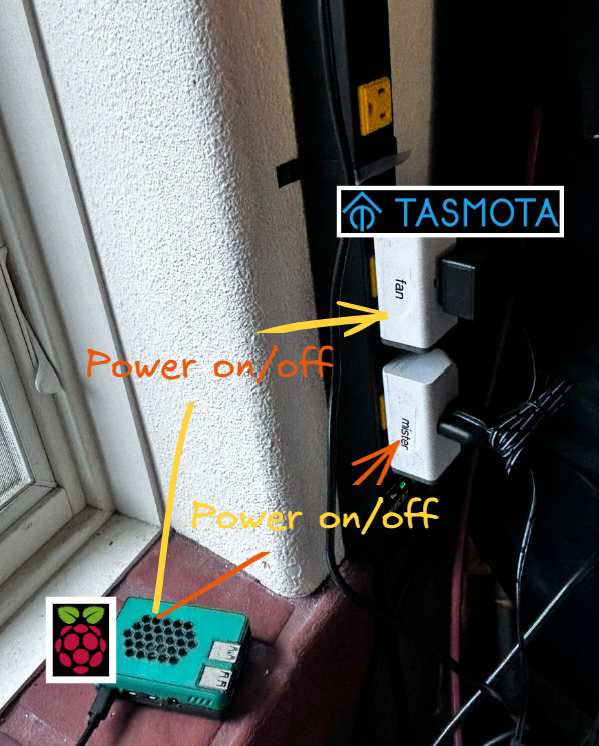

# 👋About the MistBuddy Device Project

This project builds a MistBuddy Humidifier.

<div style="text-align: center;">

</div>


The MistBuddy Device is a DIY humidifier that automatically blows mist out of its hole for a settable number of seconds every minute.

The "secret sauce" is two [Tasmotized](docs/Glossary.md#tasmota-tasmotized) power plugs that power the fan and the mister. A Raspberry Pi with MistBuddy software runs on the local wifi and sends power on/off requests for the amount of seconds defined by the user. _All data remains local. Nothing is sent to a cloud service._

<div style="text-align: center;">

</div>

The humidifier is an evolution of the one in the YouTube video [How to Build a Homemade Humidifier Using Ultrasonic Misters / fogger](https://www.youtube.com/watch?v=vmiO6Z_HLCE).

The current software that sends ON / OFF messages to a MistBuddy device can be found in the [mistbuddy_lite github repo](https://github.com/solarslurpi/mistbuddy_lite).

# 🙏 Thanks to Those That Went Before
- **THANK YOU Theo Arends**. [Tasmota](https://tasmota.github.io/docs/), created by Theo Arends in 2016, was developed to solve key pain points in smart home devices, particularly the need for local control and open communication protocols like MQTT. The project has grown significantly, with its main GitHub repository now boasting over 21,700 stars and 4,700 forks, indicating its widespread adoption in the open-source community for ESP8266 and ESP32 based devices. Tasmota's integration with MQTT allows for efficient device control and monitoring without relying on proprietary cloud services.
- **THANK YOU Oak and Spore Mushroom Farm** for the video on [How to Build a Homemade Humidifier Using Ultrasonic Misters / fogger](https://www.youtube.com/watch?v=vmiO6Z_HLCE).  The directions were clear, easy to follow, and easy to customize.
- **THANK YOU mostlychris** for the video on [Tasmota on Sonoff. Flash the S31 plug with Tasmota firmware for local control](https://www.youtube.com/watch?v=9N58uy3ezvA).  Your directions were clear and made the process seem far less intimidating.

# 🔩 Build the Humidifier
>**CAVEAT**: I have been using a build using these parts.  As in "it works for me."  I am not a professional.  I am sharing with in hopes it can benefit others.  I am not responsible for any damages to your home or property.

## 💰 BoM

The supplies needed to build this component of MistBuddy include:

| Component | Cost | Description |
|-----------|------|--------|
| Storage Tote |$10.50 | I used this [Storage Tote from Home Depot](https://www.homedepot.com/p/HDX-14-Gal-Tough-Storage-Tote-in-Black-with-Yellow-Lid-SW111/314468098).
| 2" PVC Pipe | $17.75 | Another [Home Depot purchase](https://www.homedepot.com/p/Charlotte-Pipe-2-in-x-10-ft-PVC-Schedule-40-DWV-Pipe-PVC-07200-0600/100348475).
| 2" PVC 90° elbow| $2.60  | [Home Depot](https://www.homedepot.com/p/Charlotte-Pipe-2-in-PVC-DWV-90-Degree-Hub-x-Hub-Elbow-PVC003001000HD/203393418).
| Waterproof IP67 12v Fan | $18 | I got [this fan from Amazon](https://amzn.to/3WgADKK).  It is powerful and waterproof.  It also has a nice, solid connector connecting the power source to the fan.
| Power source for the fan | $8 | [This is a very compact power source](https://amzn.to/3VT9pKp) that has the right connector to connect the fan.
| Mist maker | $34.10 | I bought the [Mist maker I use from Aliexpress](https://www.aliexpress.com/item/3256803543458943.html?spm=a2g0o.order_list.0.0.57dd1802LzMQr6).  I did not do any measurements to determine the ideal amount of misters.  Perhaps less can be used.
| Power source for the mist maker. | $40 | [The meanwell LRS-350-48 power supply(https://www.digikey.com/en/products/detail/mean-well-usa-inc/LRS-350-48/7705033).
| Float Valve | $10 | [Float Valve](https://amzn.to/43NemIL) to stop the constantly running water line from filling the tub.
| Water Source Connector | $15 (for 4) | [1/2" Barb to 1/2 " NPT female connector](https://amzn.to/3yzxlsG) _Note: The _connector fittings _assume_ 1/2"_ PEX connector to incoming water_ (see image below)

Follow the directions in the video [How to Build a Homemade Humidifier Using Ultrasonic Misters / fogger](https://www.youtube.com/watch?v=vmiO6Z_HLCE) to build the humidifier.

# ⚡Tasmotize the Power Switches
A Tasmotized power switch allows software to send Power on and off mqtt messages.  The easiest way to do this is to reflash the [SONOFF S31 Lite plugs](https://amzn.to/3xnPWYc) with Tasmota.

The reasons for the S31 plug include:
- it uses the ESP8266 microcontroller with accessible flash memory and exposed programming pins, making it amenable to custom firmware.
- the S31 Lite doesn't incorporate hardware-level restrictions like dedicated encryption chips that would prevent firmware modifications.
- it is community supported.

## 💰 Buy Two S31 Lite Plugs
These directions assumed you have two [Sonoff S31 plugs](https://amzn.to/3xnPWYc) smart plugs.
## 💥Flash the Smart Plugs
The Sonoff S31 (or S31 Lite) can be flashed so that Tasmota is running on the local wifi. [This YouTube video gives instructions on how to flash Tasmota](https://www.youtube.com/watch?v=9N58uy3ezvA).
ooh! Extra care when soldering.  If not, well...it is way too easy to rip off one of the pads...
>If soldering, it is easy to rip off the pads.  I found using [clamp fixture with pogo pins/ 2.54mm Single row 6P](https://www.aliexpress.us/item/3256804682713003.html?spm=a2g0o.order_list.order_list_main.15.4b181802cPkXRI&gatewayAdapt=glo2usa) from aliexpress to be the best way to flash without soldering.

## 📶  Connect to WiFi
When a Tasmota device is first booted after flashing, it starts in Access Point (AP) mode. This is called "Wi-Fi Configuration Mode" in Tasmota terminology.

In this mode, the device creates its own Wi-Fi network, typically named something like "tasmota-XXXXXX" where XXXXXX is a unique identifier.

- Connect to this network with your smartphone or computer. Once connected, you should be redirected to a captive portal (if not, you can manually navigate to 192.168.4.1 in a web browser).
- In this portal, configure the device to connect to your home Wi-Fi network by providing your network's SSID and password.
After you save these settings, the device will restart and attempt to connect to your specified Wi-Fi network. Note the IP address being used by the device.
- If the connection fails, the device will revert to AP mode after a few attempts, allowing you to try the configuration again.

## 🔧 Configure
Configuration include:
1. Setting up the device's GPIO pins and base device settings.
2. Configuring the device to connect to your local Wi-Fi network.
3. Setting up MQTT to enable communication with other devices on your network.

### 1. Setting up the GPIO Pins and Base Settings:
- **Access the Tasmota Web Interface**:
   - Connect your computer or smartphone to the same network as your Tasmota device.
   - Open a web browser and enter the IP address of your Tasmota device.

- **Navigate to Configuration**:
   - Once you are on the Tasmota web interface, click on **Configuration** then click on **Configure Other**.
   - In the **Template** field, paste the following template string:
     ```json
     {"NAME":"Generic","GPIO":[1,1,1,1,1,1,1,1,1,1,1,1,1,1],"FLAG":0,"BASE":18}
     ```
   - Ensure the **Activate** checkbox is selected to apply the template.

- **Save and Reboot**:
   - Click **Save** to apply the template configuration. The device will automatically reboot with the new settings.

- **Additional Resources**:
For more detailed information on creating and using templates in Tasmota, please refer to the following Tasmota documentation:
   - [Tasmota Device Templates](https://tasmota.github.io/docs/Templates/)
   - [Tasmota Configuration](https://tasmota.github.io/docs/Configuration/)

### 3. Configure MQTT Settings
[Tasmota's Backlog command](https://tasmota.github.io/docs/MQTT/#configure-mqtt-using-backlog) will be used to configure the MQTT settings.

- **Define and Execute the Backlog Command**
Assuming defaults for most things, the Host and Topic parameters are unique to your environment.   For host, I used the IP name of my Raspberry Pi, which is gus.local. The Topic is unique to each device.  One of the plugs has the topic mistbuddy_mister and the other has the topic mistbuddy_fan.  The prefix is left to the default.
The backlog command for my configuration is:
```bash
Backlog mqtthost gus.local;  topic mistbuddy_mister
```
- **Verify Messages Are Sent**
I use [MQTTExplorer](https://mqtt-explorer.com/). It's a popular tool for debugging and exploring MQTT-based systems.

# 🚀 Usage

Once you have set up a MistBuddy Device, you can control it using the MistBuddy software running on your Raspberry Pi.
